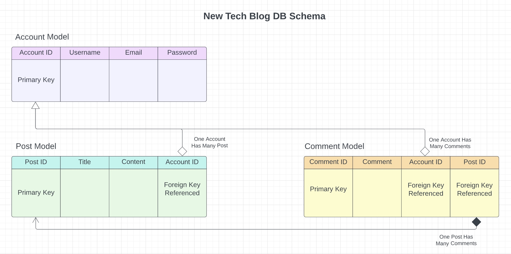

# meeting-of-the-minds
## -=Project Description=-
Utilizing MVC architecture, this challenge served as my first full stack deliverable. The application is a technology blog with a retro-tech aesthetic GUI and a robust server using MYSQL, sequelize, and REST API resource model through express. When users sign up/log in, they will be routed to their profile where they can see all the post they've written. The home page serves as the central hub for all user's posts and associated comments. Users can add comments to any post and may update/delete their own post from their profile. A perfect locale to geek out!

---
## Table of Contents
* [Installation Instructions](#installation)
* [Usage](#usage)
* [Database Relations](#database-relations)
* [Contact Information](#contact)

---

## -=Installation=-
Before running the program, install the *npm dependencies* with:

npm i

 
These include:

* bcrypt-- Utilized for password hashing
* dotenv-- Utilized to connect the user's MYSQL without leaking their confidential information
* express-- Node.js framework that provides multiple features to aid in managing servers and routes
* express-handlebars-- Provides semantic framework for effectively creating templates to populate dynamic front-end GUIs
* express-session-- Utilized to create and manage server-side session middleware
* sequelize-- Eases the stresses of working with relational databases such as our MySQL
* connect-session-sequelize-- Utilized as the session store (i.e., the place where session data is being stored on the server)
* mysql2-- Used to create our MySQL database that hosts our relational data

 

## -=Usage=-
To run the code, first open your mysql using: 

mysql -u root -p

 

 
and enter in your password. Then run:
  

SOURCE db/schema.sql;

 
to create and enter the database. Quit mysql and type in the command line:
  

npm run seed

  

 
to seed the data. Finally type:
  

node server.js <em>OR</em> npm start

 

 
in the command line of the root directory to launch the server. Navigate to "localhost:3001" to view the application.
  

## -= Database Relations =-

## -=Contact=-

Check out the [Heroku deployed application]() and feel free to look at my other work on my [GitHub](https://github.com/AHudg).

Made by Andrew Hudgins :)